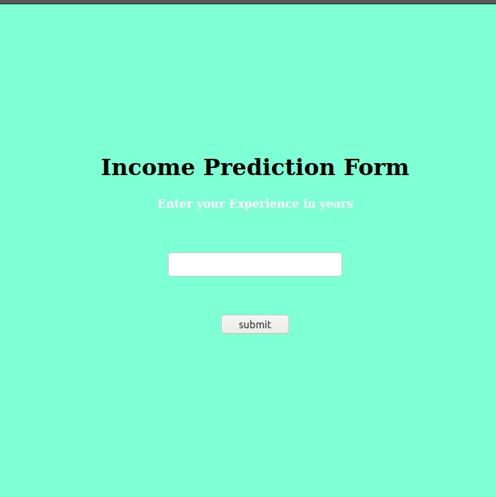
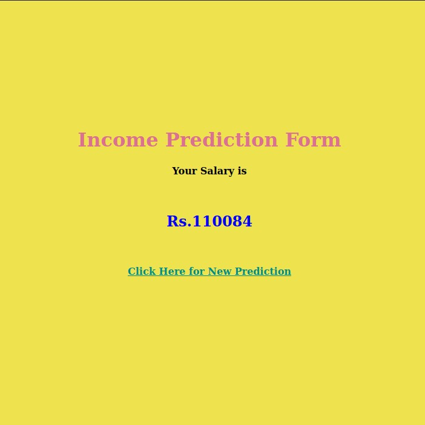

# ML Deployment Using Flask
This is a simple Machine learning deployment web app using python and Webframework Flask.The dataset which had dependant and independant variables(Salary and Experience),by using linear regression algorithm we can predict the salary with respect to experience.

